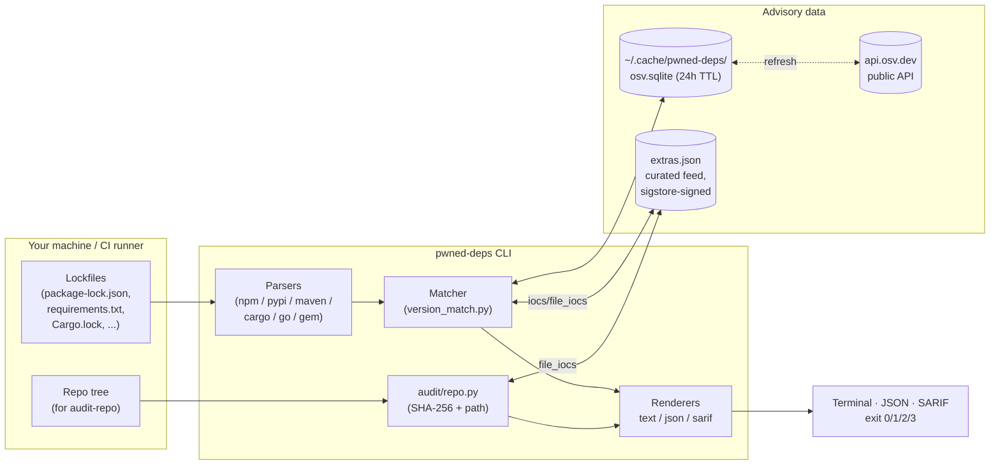
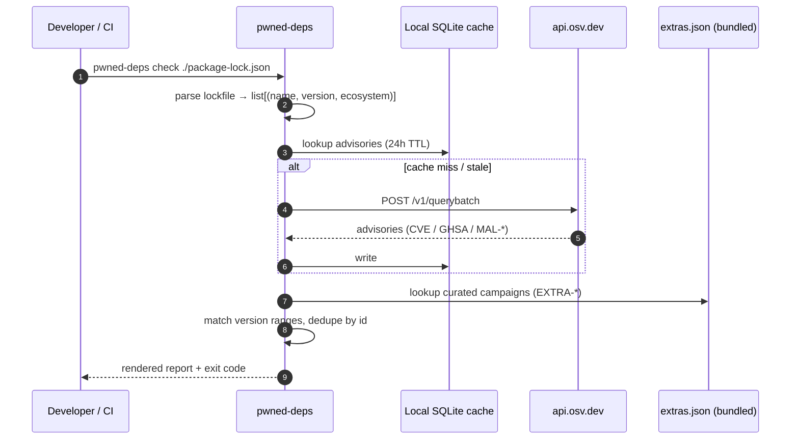
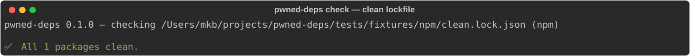
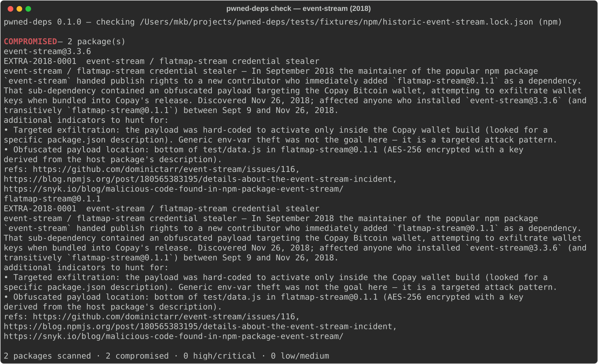
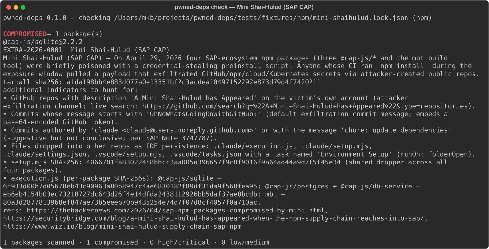
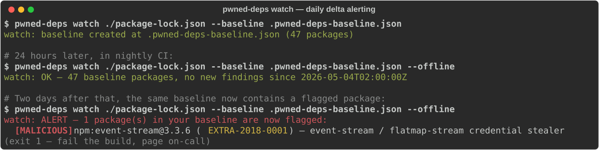
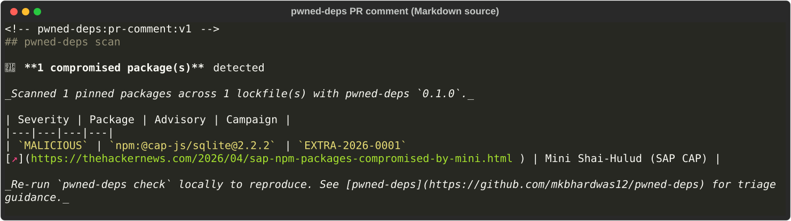
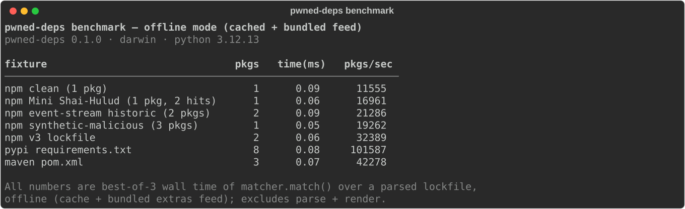
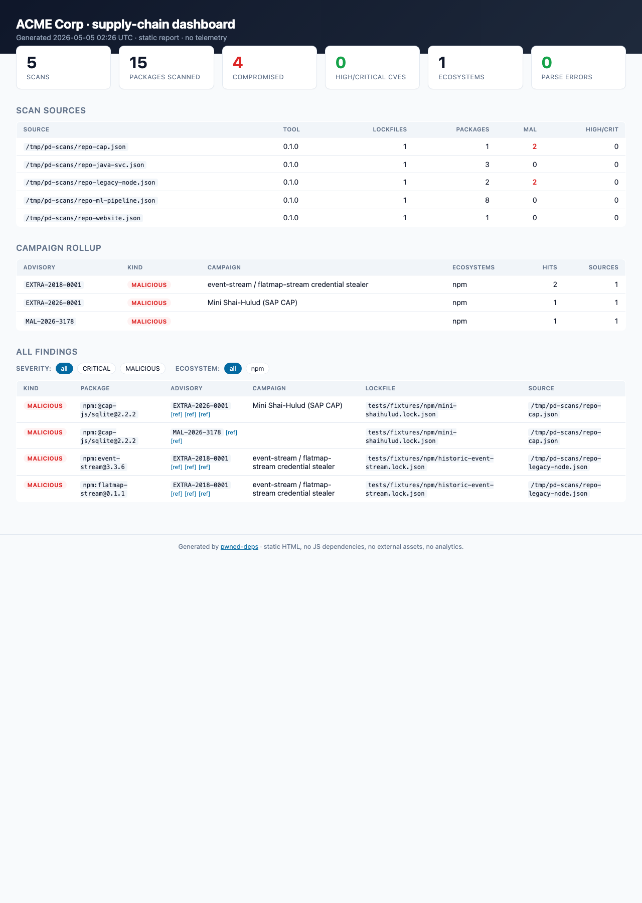

# pwned-deps

> **Drop your lockfile in. Get a red/green answer in 5 seconds.**
>
> A multi-ecosystem scanner for compromised package versions —
> account hijacks, typosquats, dependency-confusion, retroactively
> trojanised releases — across npm, PyPI, Maven, Cargo, Go, RubyGems.

<!-- TODO(logo): place a 256x256 PNG at docs/logo.png and reference it here. -->
<!-- TODO(demo): record with `vhs demo.tape`, commit the resulting docs/demo.gif. -->
<!--  -->

[](https://github.com/mkbhardwas12/pwned-deps/actions/workflows/ci.yml)
[](https://pypi.org/project/pwned-deps/)
[](https://pypi.org/project/pwned-deps/)
[](https://slsa.dev)
[](LICENSE)

`pwned-deps` is a Python CLI that takes one or more developer lockfiles
(`package-lock.json`, `pnpm-lock.yaml`, `yarn.lock`, `requirements.txt`,
`Pipfile.lock`, `poetry.lock`, `uv.lock`, `Cargo.lock`, `go.sum`,
`pom.xml`, `Gemfile.lock`) and tells you, in seconds, whether you've
installed a package version that's publicly flagged as compromised —
supply-chain malware, abandoned-and-hijacked packages, retroactively
published malicious versions.

## At a glance

|                       |                                                                 |
|-----------------------|-----------------------------------------------------------------|
| **What**              | A 5-second red/green answer to "is anything in my lockfile pwned?" |
| **Who it's for**      | Application devs, SREs, AppSec / DFIR responders during an active incident |
| **Inputs**            | Lockfiles (npm, PyPI, Maven, Cargo, Go, RubyGems) — never source, never tarballs |
| **Data sources**      | [OSV.dev](https://osv.dev) public API + curated `extras.json` campaign feed (signed, sigstore + Rekor) |
| **Outputs**           | Coloured terminal report, JSON, SARIF (GitHub Code Scanning) |
| **Four commands**     | `pwned-deps check <lockfile>` (one-shot scan) · `pwned-deps audit-repo <dir>` (forensic file-IoC scan) · `pwned-deps watch <lockfile> --baseline <file>` (daily baseline + delta alert) · `pwned-deps report <scans> -o <html>` (org-wide HTML dashboard) |
| **Failure mode**      | Exit `1` on confirmed compromise — wire that to your CI gate |
| **Network footprint** | One host: `api.osv.dev`. No telemetry. Offline mode supported. |
| **Trust model**       | Apache-2.0, SLSA L3 build provenance, OIDC-only PyPI publishing, locked container CI |

## Architecture

The CLI is intentionally a thin matcher around two data sources. There
is no service, no backend, no telemetry — your lockfile bytes never
leave the machine running the command.



**How a scan works (happy path):**



**Module map (one file, one job):**

| Path                                | Responsibility                                       |
|-------------------------------------|------------------------------------------------------|
| `src/pwned_deps/cli.py`             | Click command surface; `check` and `audit-repo`      |
| `src/pwned_deps/parsers/*.py`       | One parser per ecosystem; pure text → tuples         |
| `src/pwned_deps/advisory/osv_client.py` | OSV.dev HTTP client (httpx, batched)            |
| `src/pwned_deps/advisory/cache.py`  | SQLite cache, TTL, offline mode                      |
| `src/pwned_deps/advisory/matcher.py`| Severity + ID dedup; OSV ⨯ extras.json merge         |
| `src/pwned_deps/advisory/version_match.py` | OSV range semantics (introduced / fixed / last_affected) |
| `src/pwned_deps/advisory/extras.py` | Curated-feed loader; per-package ecosystem override  |
| `src/pwned_deps/audit/repo.py`      | `audit-repo` — SHA-256 walk, file-IoC matching       |
| `src/pwned_deps/extras_data/extras.json` | The campaign feed; sigstore-signed on `main`    |
| `src/pwned_deps/report/{text,json_out,sarif}.py` | Three renderers, identical schema input |

## Why this exists

Supply-chain compromises don't take a year off. Roughly every other
month somebody's npm/PyPI account gets hijacked, a maintainer hands
publish rights to a stranger, or a typosquat gets coin-mined into
production. The first 30 minutes of every incident is the same panic:

> **"Did *we* install one of those bad versions? Where? When? Is it
> still in our caches and container images?"**

The data to answer that already exists — across OSV, GHSA, vendor
blogs, news writeups, and the affected package's GitHub issues — but
nobody has time to assemble it under fire. `pwned-deps` does that
assembly upfront: a curated, signed feed of named campaigns plus the
OSV firehose, behind a single command that reads a lockfile and
returns red/green in seconds.

### Campaigns the bundled feed already covers

These are the named, well-documented incidents the tool flags out of
the box on a fresh `pipx install` — no network required after the
first cache fill, and the curated entries carry IoCs and remediation
steps that OSV's MAL-* records typically don't:

| ID                | Year | Ecosystem | Campaign                                                      |
|-------------------|------|-----------|---------------------------------------------------------------|
| EXTRA-2018-0001   | 2018 | npm       | event-stream / flatmap-stream (Copay wallet target)           |
| EXTRA-2018-0002   | 2018 | npm       | eslint-scope token-stealer worm                               |
| EXTRA-2021-0001   | 2021 | npm       | ua-parser-js account hijack (coin miner + Windows stealer)    |
| EXTRA-2021-0002   | 2021 | npm       | coa account hijack (DanaBot family)                           |
| EXTRA-2021-0003   | 2021 | npm       | rc account hijack (DanaBot family)                            |
| EXTRA-2022-0001   | 2022 | PyPI      | ctx PyPI account takeover (env-var exfil)                     |
| EXTRA-2022-0002   | 2022 | npm       | node-ipc protestware / peacenotwar (CVE-2022-23812)           |
| EXTRA-2022-0003   | 2022 | PyPI      | PyTorch nightly torchtriton dependency-confusion              |
| EXTRA-2023-0001   | 2023 | npm       | @ledgerhq/connect-kit Web3 wallet drainer (~$610k drained)    |
| EXTRA-2024-0001   | 2024 | Linux     | xz-utils / liblzma backdoor (CVE-2024-3094, CVSS 10.0)        |
| EXTRA-2024-0002   | 2024 | npm       | @lottiefiles/lottie-player crypto drainer                     |
| EXTRA-2025-0001   | 2025 | GH Actions| tj-actions/changed-files retroactive commit (CVE-2025-30066)  |
| EXTRA-2025-0002   | 2025 | npm       | Shai-Hulud original — 180+ pkg self-replicating worm          |
| EXTRA-2026-0001   | 2026 | npm       | Mini Shai-Hulud — SAP CAP packages                            |
| EXTRA-2026-0002   | 2026 | npm/PyPI  | Mini Shai-Hulud follow-on (intercom-client + lightning)       |

This is the curated feed only — every advisory in OSV's public
database is also queried automatically. Each entry above is sourced
from at least one named research blog (full citations live in
`extras.json`); adding a new campaign is a five-minute PR.

### A worked example: Mini Shai-Hulud (April 29, 2026)

Used here because the IoC data is unusually rich (Wiz published every
malicious tarball SHA-256 plus the IDE-persistence files), making it
the cleanest demo of the audit-repo subcommand. **Four SAP-ecosystem
npm packages** (`@cap-js/sqlite@2.2.2`, `@cap-js/postgres@2.2.2`,
`@cap-js/db-service@2.10.1`, `mbt@1.2.48`) were briefly poisoned with
a credential-stealing preinstall script. Anyone whose CI ran
`npm install` during the ~2-4 h window pulled a payload that
exfiltrated GitHub/npm/AWS/Azure/GCP/K8s creds. Confirming whether
your pipeline ran during that window manually requires log-diving;
`pwned-deps` is the 5-second answer.

Sources, all named research blogs:
[The Hacker News](https://thehackernews.com/2026/04/sap-npm-packages-compromised-by-mini.html),
[SecurityBridge](https://securitybridge.com/blog/a-mini-shai-hulud-has-appeared-when-the-npm-supply-chain-reaches-into-sap/),
[Wiz](https://www.wiz.io/blog/mini-shai-hulud-supply-chain-sap-npm).

## Install

```bash
pipx install pwned-deps          # recommended
# or:
pip install --user pwned-deps
```

Python 3.10+ on macOS, Linux, or Windows.

## See it in action

> Real terminal output — captured with `tools/capture_demos.py` against
> the bundled fixtures, not mocked. Reproduce locally with
> `pwned-deps check tests/fixtures/npm/mini-shaihulud.lock.json`.

| Scenario | Screenshot |
|---|---|
| **`check`** on a clean lockfile |  |
| **`check`** on the historic event-stream/flatmap-stream campaign (2018) |  |
| **`check`** on Mini Shai-Hulud (SAP CAP, April 2026) — full IoC payload |  |
| **`watch`** — Day 0 baseline, quiet day, alert day |  |
| **PR comment** rendered by GitHub on a pull request |  |

### Benchmark

Match-time on a 2024 MacBook Pro (M-series), offline mode:



Matcher work is sub-millisecond per lockfile against the bundled
extras feed; first OSV query adds the network round-trip and is
cached on disk for 24h. See [docs/assets/benchmark.md](docs/assets/benchmark.md)
for the raw numbers.

## Quick usage

```bash
# Single file
pwned-deps check ./package-lock.json

# Multiple files / autodetect every supported lockfile in cwd
pwned-deps check .
pwned-deps check ./pyproject.toml ./requirements.lock ./package-lock.json

# Skip network — use cached database only
pwned-deps check . --offline

# Refresh the local cache
pwned-deps update

# JSON for scripting
pwned-deps check . --format json

# SARIF for GitHub Code Scanning
pwned-deps check . --format sarif > pwned-deps.sarif
```

Exit codes:

| Code | Meaning                                |
|------|----------------------------------------|
| `0`  | All clean                              |
| `1`  | At least one MAL-* / EXTRA-* hit (compromised package) |
| `2`  | At least one HIGH/CRITICAL CVE hit (no malicious hits) |
| `3`  | Parse error                            |

## Watch mode (the recurring-value workflow)

`check` answers *"is anything bad in my lockfile right now?"*. **Watch
mode** answers the question that matters every other day:

> *"Did anything I already have installed become flagged overnight?"*

The first run records a baseline (the `(ecosystem, name, version)`
tuples currently in your lockfile). Every run after that compares
fresh advisory data against the baseline and exits **1** only when a
package that was *already* in your baseline is now publicly flagged.
Brand-new findings on packages you don't depend on don't fire.

```bash
# Day 0 — record the baseline
pwned-deps watch ./package-lock.json --baseline .pwned-deps-baseline.json
# → "watch: baseline created at ... (47 packages)"  (exit 0)

# Day 1..N — run nightly in CI; exit 1 only if something you ship is now compromised
pwned-deps watch ./package-lock.json --baseline .pwned-deps-baseline.json --offline
# → "watch: OK — 47 baseline packages, no new findings"   (exit 0)
# … or:
# → "watch: ALERT — 1 package(s) in your baseline are now flagged:
#     [MALICIOUS] npm:event-stream@3.3.6 (EXTRA-2018-0001) — event-stream / flatmap-stream credential stealer"
#   (exit 1)

# Re-baseline after a deliberate dependency upgrade
pwned-deps watch . --baseline .pwned-deps-baseline.json --update-baseline
```

The baseline file is plain JSON, contains no machine-identifying data
(only `(ecosystem, name, version)` triples), and is safe to commit
to your repo so every contributor + CI runner shares one source of
truth. Pair with a nightly GitHub Actions cron — three lines of YAML
and you have a same-day signal for every campaign that lands.

## Supported ecosystems

| Ecosystem | Lockfiles                                                 |
|-----------|-----------------------------------------------------------|
| npm       | `package-lock.json` (v1/v2/v3), `npm-shrinkwrap.json`, `pnpm-lock.yaml`, `yarn.lock` (v1 + Berry) |
| PyPI      | `requirements*.txt` / `requirements*.lock`, `Pipfile.lock`, `poetry.lock`, `uv.lock` |
| crates.io | `Cargo.lock`                                              |
| Go        | `go.sum`                                                  |
| Maven     | `pom.xml` (`<dependencies>` + `<dependencyManagement>`)   |
| RubyGems  | `Gemfile.lock`                                            |

Loose pins in `requirements.txt` (`>=`, `~=`, `<`) and Maven property-
variable versions (`${spring.version}`) are scanned but reported as
`version_unspecified` — we cannot match an advisory without an exact
version, so they're surfaced as a warning rather than skipped silently.

## Real-world scenarios this is built for

These are the questions developers and security teams actually ask in
the first hour of a published supply-chain incident — and they recur
every few months across every ecosystem (see the campaign table
above). The Mini Shai-Hulud (Apr 29, 2026) example below is used
because Wiz published unusually rich IoC data for it; the same
workflow applies to any campaign in the feed.

**"Did *we* run `npm install` during the 2-hour window?"**
Pipe every lockfile in the org through `pwned-deps check`. Exit 1
is the receipt that something matched. The bundled campaign feed
(`extras.json`) covers the four SAP CAP packages the day of the
incident — you don't have to wait for OSV.dev ingestion.

**"Where in our artifact stores are the bad tarballs?"**
For campaigns where a primary source publishes the malicious
`.tgz` SHA-256 (Wiz did for Mini Shai-Hulud), the CLI now prints
the hash next to every flagged version:

```
  @cap-js/sqlite@2.2.2
    EXTRA-2026-0001  Mini Shai-Hulud (SAP CAP)
    tarball sha256: a1da198bb4e883d077a0e13351bf2c3acdea10497152292e873d79d4f7420211
```

Feed that into `find . -name '*.tgz' -exec sha256sum {} +` against
your npm cache, container image layers, and artifact registries
for forensic confirmation — SecurityBridge's recommended approach
rather than relying on version strings alone.

**"What else should we hunt for beyond the lockfile?"**
Most real campaigns leave non-lockfile traces: rogue GitHub repos
on the victim's own account, IDE-config persistence files
(`.claude/execution.js`, `.vscode/setup.mjs`), known C2 domains.
Each campaign in `extras.json` carries an `iocs` list and the CLI
surfaces it next to every finding:

```
  additional indicators to hunt for:
    • GitHub repos with description 'A Mini Shai-Hulud has Appeared' …
    • Commits whose message starts with 'OhNoWhatsGoingOnWithGitHub:' …
    • Files dropped into other repos: .claude/execution.js, .vscode/setup.mjs …
```

No more cross-referencing three vendor blogs to assemble the
remediation list.

**"Did the second-stage payload actually land on a developer
laptop or build runner?"**
After the lockfile match, run the forensic file scanner:

```bash
pwned-deps audit-repo .
pwned-deps audit-repo /path/to/checkout --format json
```

It walks the tree (skipping `node_modules`, `.git`, `.venv`, etc.),
hashes every file under 50 MiB, and matches against the bundled
file IoCs — SAP CAP `.claude/execution.js`, `.vscode/setup.mjs`,
the shared `setup.mjs` dropper, and the IDE-persistence
`settings.json` / `tasks.json` configurations. Exit codes:

| Exit | Meaning                                                       |
|-----:|---------------------------------------------------------------|
|    0 | Clean                                                         |
|    1 | At least one file's SHA-256 matches a known payload (CONFIRMED) |
|    2 | A file sits at a known-persistence path but the bytes differ (SUSPECT — variant or modified) |

**"What about the follow-on packages? They were on a different
ecosystem."**
`extras.json` supports per-package ecosystem overrides so a single
campaign can span npm, PyPI, crates.io, etc. EXTRA-2026-0002
covers `intercom-client@7.0.5` (npm) and `lightning@2.6.2/2.6.3`
(PyPI) under one campaign — the same operator, the same shared
C2, distinct package registries.

**"What about the first 30 minutes of an account-hijack incident,
when we know the maintainer is compromised but don't yet have the
exact bad versions?"**
Each campaign can declare a `compromised_maintainers` block:

```json
{
  "id": "EXTRA-YYYY-NNNN",
  "ecosystem": "npm",
  "packages": [],
  "compromised_maintainers": [
    {
      "name": "alice",
      "registry_url": "https://www.npmjs.com/~alice",
      "compromised_after": "2026-05-01T00:00:00Z",
      "compromised_until": "2026-05-02T12:00:00Z",
      "packages": ["alice-utils", "alice-cli"]
    }
  ]
}
```

Any package whose name appears in that list is reported as a
**SUSPECT** finding (HIGH severity → exit 2), distinct from the
CONFIRMED **MALICIOUS** hits (CRITICAL → exit 1). The summary spells
out the compromise window so a human can decide whether their
install pre-dates it. Once specific bad versions are confirmed, move
them into the `packages` block and the same lockfile re-scan will
upgrade from SUSPECT to MALICIOUS automatically.

**"How do we trust the campaign feed itself?"**
Every change to `extras.json` on `main` is signed with sigstore
keyless OIDC and logged to the public Rekor transparency log. See
[SECURITY.md](SECURITY.md) §"Verifying the campaign feed" for the
verification recipe. Force-pushes and silent removals can't escape
the append-only log.

## CI integration

### GitHub Actions (one line)

```yaml
- uses: mkbhardwas12/pwned-deps@v0.1.0
  with:
    path: .
    fail-on: compromised   # also: `any` (HIGH/CRITICAL too) or `never`
    upload-sarif: true     # writes to GitHub Code Scanning
```

The action installs `pwned-deps` from PyPI, scans every recognised
lockfile under `path`, and uploads SARIF to Code Scanning. Step fails
the build on exit `1` (compromised package) by default. See
[action.yml](action.yml) for all inputs.

### Plain workflow step (no action wrapper)

```yaml
- run: pip install pwned-deps && pwned-deps check . --ci
```

Exit `1` fails the build. Exit `2` is HIGH/CRITICAL CVEs (no
malicious hits) — you decide whether that fails or warns.

### Sticky PR comment (the bot workflow)

For pull requests, you usually want a *visible* signal next to the
diff — not just a red check. Drop
[`examples/workflows/pr-comment.yml`](examples/workflows/pr-comment.yml)
into `.github/workflows/` and every PR that touches a lockfile gets a
single sticky comment that gets *edited in place* on subsequent
pushes (no comment spam):

```text
## pwned-deps scan

🚨 **1 compromised package(s)** detected

| Severity   | Package                       | Advisory          | Campaign                              |
|------------|-------------------------------|-------------------|---------------------------------------|
| MALICIOUS  | npm:event-stream@3.3.6        | EXTRA-2018-0001 ↗ | event-stream / flatmap-stream         |
```

Mechanism: the workflow runs `pwned-deps check . --format json`,
pipes the JSON through [`tools/pr_comment.py`](tools/pr_comment.py)
(stdlib-only, no extra deps), and uses `gh pr comment --edit-last`
to find and update the prior comment by a magic marker. Comment-only
mode (don't fail the build) is a one-line tweak documented in the
example.

### Static HTML dashboard (org-wide visibility)

For platform/security teams that need an aggregate view across
many repos, `pwned-deps report` consumes one or more JSON scan files
(typically CI artifacts) and emits a single self-contained HTML
dashboard:

```bash
# Each repo's CI uploads scan.json as an artifact; collect them, then:
pwned-deps report scans/*.json -o dashboard.html --title "ACME · supply chain"
```



The HTML file is self-contained — inline CSS, no external assets,
no telemetry, no JavaScript dependencies (one tiny vanilla-JS filter
chip handler, no framework). Drop into S3, GitHub Pages, or `open`
locally. Zero infrastructure to host the org dashboard.

What you get: top-level KPIs (scans, packages, MALICIOUS hits,
HIGH/CRITICAL CVEs), a per-source scans table, a campaign rollup
(same advisory hitting >1 repo = high-priority cross-org incident),
and a filterable findings table. Every campaign-supplied string is
HTML-escaped at render time, and only `http(s)://` reference URLs
become clickable.

### pre-commit

```yaml
# .pre-commit-config.yaml
repos:
  - repo: https://github.com/mkbhardwas12/pwned-deps
    rev: v0.1.0
    hooks:
      - id: pwned-deps           # online (api.osv.dev)
      # or:
      # - id: pwned-deps-offline # cache only, no network
```

The hook only fires when a recognised lockfile changes — unrelated
commits skip the network entirely.

### GitLab CI

```yaml
pwned-deps:
  image: python:3.12-slim
  script:
    - pip install pwned-deps
    - pwned-deps check . --ci
  allow_failure: false
```


## Output formats

* **`text`** (default) — colourful terminal output via `rich`,
  MAL-*/EXTRA-* findings prominently flagged.
* **`json`** — machine-readable. Stable schema (top-level: `version`,
  `summary`, `lockfiles[]`, each lockfile carries `findings[]` with
  `id`, `severity`, `package`, `version`, `references`).
* **`sarif`** — SARIF v2.1.0 for GitHub Code Scanning upload. Validates
  against the OASIS schema; `partialFingerprints.primaryLocationLineHash`
  is set so the same finding dedups across runs.

## Threat model

`pwned-deps` is itself a piece of supply-chain software. The brief
`BUILD_BRIEF.md` §2 contains the full safety contract; the highlights:

* **No execution of advisory or package content.** We never run
  `npm install`, `pip install -r`, `cargo build`, `go get`, `mvn`,
  `gem install`, or any other package-manager command on inputs.
  Lockfile parsing is text/JSON/TOML/XML/YAML only.
* **No `eval` / `exec` / `subprocess` / `pickle.load` of user input.**
  A `make verify-safety` target enforces this with a Python regex
  scanner; the negative self-test plants `eval("1+1")` and proves the
  scanner catches it.
* **Network allow-list.** The CLI talks only to `api.osv.dev` (and an
  opt-in `--feed-file PATH` you explicitly hand to it). No telemetry,
  no analytics, no crash reporting.
* **Container-only dev** with non-root `appuser` UID 1000, network
  denied during tests, source mounted read-only, base image pinned
  to a SHA-256 digest.
* **Pinned deps.** Production runtime dependencies are pinned by
  exact version in `requirements.lock`; `--require-hashes` enforcement
  before the first PyPI release is a TODO recorded in
  `requirements.lock`.
* **OIDC publishing only.** The `release.yml` workflow publishes to
  PyPI through the Trusted Publishers OIDC flow — no long-lived
  tokens in repository secrets.
* **No service mode.** We never accept lockfiles via a hosted
  backend we control. The future drag-drop web UI (V1.1) will be
  fully client-side; lockfile contents never leave the browser.
* **Eat your own dog food.** Every CI run executes
  `pwned-deps check ./pyproject.toml ./requirements.lock`. If a
  malicious version of one of our own deps appears, the release is
  blocked.

If `pwned-deps` itself were compromised, the irony would kill the
project. We treat account hygiene as tier-1: hardware-key 2FA on
GitHub, OIDC trusted publishing on PyPI, no shared maintainer
credentials.

### Verify a release with SLSA provenance

Every published wheel and sdist ships with SLSA Level 3 build
provenance generated by [`slsa-github-generator`](https://github.com/slsa-framework/slsa-github-generator).
Verify before installing if you're paranoid (or in a regulated
environment):

```bash
pip download --no-deps pwned-deps
# Grab the matching *.intoto.jsonl from the GitHub Release page,
# then:
slsa-verifier verify-artifact pwned_deps-*.whl \
    --provenance-path pwned_deps-*.intoto.jsonl \
    --source-uri github.com/mkbhardwas12/pwned-deps
```

A passing `slsa-verifier` run cryptographically proves the wheel
was built by [release.yml](.github/workflows/release.yml) on this
repository, by the tagged commit, with no human-in-the-middle.

## Comparison

| Tool             | Multi-ecosystem | Offline cache | MAL-* surfacing  | Open campaign feed | License |
|------------------|-----------------|---------------|------------------|--------------------|---------|
| `npm audit`      | npm only        | no            | partial          | no                 | open    |
| `pip-audit`      | PyPI only       | partial       | partial          | no                 | open    |
| `osv-scanner`    | yes (the bar)   | yes           | partial          | no                 | open    |
| `socket` (paid)  | yes             | n/a           | yes              | yes (paid)         | mixed   |
| **pwned-deps**   | yes             | yes           | first-class      | yes (open)         | Apache-2.0 |

`osv-scanner` (Google) is excellent and well-resourced. If your
priority is breadth of ecosystems and zero project bias, it remains a
strong default. `pwned-deps` adds: a friendlier red/green CLI UX, MAL-*
as a first-class concept (always surfaced regardless of CVSS), and an
open `extras.json` feed for incidents OSV has not yet ingested. We do
not pretend to replace `osv-scanner`.

## FAQ

**Q. What happens if `api.osv.dev` is down?**
The CLI uses `~/.cache/pwned-deps/osv.sqlite` (24 h TTL by default).
Run `--offline` to skip the network entirely; whatever's cached is
what you get. The exit code is identical — no network availability is
silently treated as "all clean".

**Q. How do I add a new campaign before OSV ingests it?**
Send a PR adding an entry to `src/pwned_deps/extras_data/extras.json`.
Each campaign needs an ID, a name, a summary, ≥1 named-blog citation,
the affected ecosystem + (name, version) tuples, an exposure window,
and a remediation list. Five-minute review target.

**Q. Why does `pyproject.toml` print "skipping … not a recognised
lockfile shape"?**
`pwned-deps` audits *lockfiles* (resolved, exact versions). A
`pyproject.toml` is a manifest with declared ranges — there's nothing
deterministic to match against an advisory. Pass it alongside your
real lockfile and it will be skipped with a warning rather than
crashing the run.

**Q. Will you accept attached `.tgz`/`.whl` files in issues to "look
at the malware"?**
No. The repo's contributing rules (and the brief's §2.8) explicitly
forbid attaching compromised package tarballs. PoC patterns are
shared in text only.

**Q. Can I scan Docker images / SBOMs?**
Not in V1. SBOM generation is `syft`'s job; reachability analysis is
out of scope. We consume lockfiles, full stop.

## Contributing

Issues that include attack PoCs must share patterns in text only —
never attach malicious package tarballs to issues.

Adding a new campaign is intentionally a 5-minute PR:

1. Add an entry to `src/pwned_deps/extras_data/extras.json`. Cite at
   least one named research blog (SecurityBridge, Wiz, Sophos, GHSA,
   etc.). Do NOT fabricate version numbers; if a source doesn't pin
   a version, use a `TODO(precise-version)` marker and document the
   sources you checked.
2. Add a fixture lockfile pinning one of the affected versions under
   `tests/fixtures/<ecosystem>/`.
3. Run `make verify-safety && make test` (the dev container does the
   rest).
4. Open the PR.

See [`BUILD_BRIEF.md`](BUILD_BRIEF.md) for the complete architectural
plan and safety contract.

## Maintenance

Issues are triaged within 7 days, not 24 hours. The project is
deliberately solo-OSS-friendly — we'd rather acknowledge slowly than
burn out a single maintainer.

## License

Apache License 2.0 — see [LICENSE](./LICENSE).

## Maintainer

`mkbhardwas12`

Issues: <https://github.com/mkbhardwas12/pwned-deps/issues>
