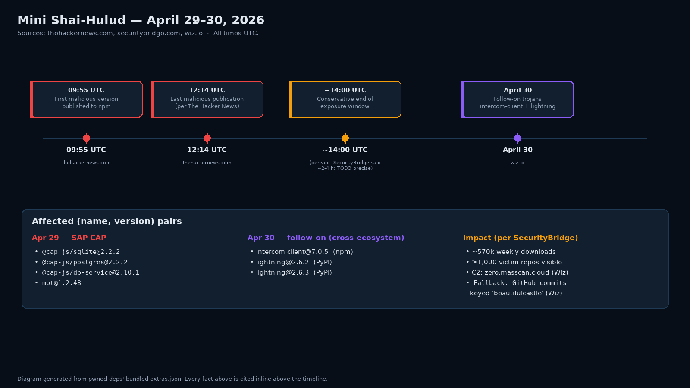

# Drop your lockfile in, find out if you're pwned

> Launch post for **pwned-deps v0.1.0** — a multi-ecosystem CLI that
> takes a developer lockfile and tells you, in seconds, whether you've
> installed a package version that's publicly flagged as compromised.
>
> Suitable for Medium, Dev.to, Hashnode, or any markdown blog. Every
> claim about Mini Shai-Hulud is hyperlinked to the named research
> blog that published it. The PNG diagrams referenced below live in
> `docs/images/` of the [project repo](https://github.com/mkbhardwas12/pwned-deps).

---

## The 5-second question every developer asks during a supply-chain attack

When the next npm/PyPI/Cargo supply-chain incident lands — and one will,
soon — the first thing every affected developer will ask is:

> **"Did I install one of those bad versions?"**

Today, the answer is buried across at least five places: vendor blogs,
GHSA advisories, OSV, the package's own security-advisory tab, and the
news article. By the time you've cross-referenced your `package-lock.json`
against all of them, the attacker has already walked off with whatever
secrets your CI could reach.

I wrote `pwned-deps` so the answer can be one command:

```bash
pipx install pwned-deps
pwned-deps check ./package-lock.json
```

Red or green, in seconds. Exit code `1` if any compromised package is
on disk, with the campaign name, exposure window, published SHA-256
of the bad tarball, and remediation list.

This post is the launch story, the architecture, the safety posture,
and an honest comparison with the existing tools.

---

## The launch peg — Mini Shai-Hulud, April 29, 2026



Between **09:55 UTC and 12:14 UTC** on April 29, 2026, four packages
in the SAP / `@cap-js` npm ecosystem were briefly poisoned with a
credential-stealing preinstall script ([The Hacker News](https://thehackernews.com/2026/04/sap-npm-packages-compromised-by-mini.html)).
The exact compromised versions, confirmed by all three primary
sources ([Wiz](https://www.wiz.io/blog/mini-shai-hulud-supply-chain-sap-npm),
[SecurityBridge](https://securitybridge.com/blog/a-mini-shai-hulud-has-appeared-when-the-npm-supply-chain-reaches-into-sap/),
[The Hacker News](https://thehackernews.com/2026/04/sap-npm-packages-compromised-by-mini.html)):

- `@cap-js/sqlite@2.2.2` — sha256 `a1da198bb4e883d077a0e13351bf2c3acdea10497152292e873d79d4f7420211`
- `@cap-js/postgres@2.2.2` — sha256 `1d9e4ece8e13c8eaf94cb858470d1bd8f81bb58f62583552303774fa1579edee`
- `@cap-js/db-service@2.10.1` — sha256 `258257560fe2f1c2cc3924eae40718c829085b52ae3436b4e46d2565f6996271`
- `mbt@1.2.48` — sha256 `86282ebcd3bebf50f087f2c6b00c62caa667cdcb53558033d85acd39e3d88b41`

(SHA-256 digests as published by Wiz.)

The packages had a combined **~570,000 weekly downloads** and
**at least a thousand victim repositories** were visible to a public
GitHub search within hours, based on the attacker's signature description
string ([SecurityBridge](https://securitybridge.com/blog/a-mini-shai-hulud-has-appeared-when-the-npm-supply-chain-reaches-into-sap/)).
The preinstall script exfiltrated GitHub PATs, npm tokens, AWS / Azure /
GCP credentials, Kubernetes ServiceAccount tokens, and CI/CD secrets.

The exposure window per [SecurityBridge](https://securitybridge.com/blog/a-mini-shai-hulud-has-appeared-when-the-npm-supply-chain-reaches-into-sap/)
was *"roughly two to four hours"*. No source I checked publishes the
exact npm-registry pull time, so `pwned-deps` ships a conservative
upper bound (`2026-04-29T14:00:00Z`) marked `TODO(precise-window)` —
maintainers can tighten it the moment a primary source confirms.

**A day later — April 30, 2026** — the same operator trojanised three
more package versions ([Wiz](https://www.wiz.io/blog/mini-shai-hulud-supply-chain-sap-npm)):

- `intercom-client@7.0.5` *(npm — Intercom's official client SDK)*
- `lightning@2.6.2` *(PyPI — PyTorch Lightning)*
- `lightning@2.6.3` *(PyPI — PyTorch Lightning)*

The campaign crosses ecosystems: a Python project pinning
`lightning==2.6.2` is just as exposed as an npm project pinning
`intercom-client@7.0.5`. `pwned-deps`'s extras feed flags the
ecosystem on each individual `(name, version)` entry, so a
`requirements.txt` lookup hits the same campaign record an npm
lockfile would. Same shared C2 (`zero.masscan.cloud`) and the same
fallback channel via GitHub commits keyed `beautifulcastle`. The April-30 payload had been extended
to target HashiCorp Vault tokens and Kubernetes ServiceAccounts, on top
of the original AWS / GitHub / npm theft.

If your CI ran any flavour of `npm install` against an unpinned range
during that window, you don't have a "did we?" question — you have a
"how bad?" question.

`pwned-deps` is the answer.

---

## What it does, in one diagram


The data flow is small enough to fit on one screen:

1. **Read a lockfile.** Eleven lockfile shapes are recognised across
   six ecosystems — npm, PyPI, crates.io, Go, Maven, RubyGems. The
   parsers are all text/JSON/TOML/YAML/XML. We never run `npm install`,
   `pip install`, `cargo build`, `go get`, `mvn`, or `gem install` on
   anything we read.
2. **Match against a bundled `extras.json`** for very-recent campaigns
   that OSV hasn't yet ingested. Mini Shai-Hulud and the April-30
   follow-on are in the bundled feed today; new campaigns land via a
   5-minute community PR (more on that below).
3. **Batch-query** [OSV.dev](https://osv.dev) — the Google-maintained
   federation of GHSA, the PyPI Advisory Database, RustSec, the Go
   vulnerability database, and the Ruby Advisory Database.
4. **Render a report** — colourful terminal output by default; JSON for
   scripting; SARIF v2.1.0 for upload to GitHub Code Scanning. Exit
   codes are deterministic: `0` clean, `1` malicious hit, `2`
   HIGH/CRITICAL CVE hit, `3` parse error.


The whole flow is sub-second offline (everything but step 6 runs from
the cache). Online, the `/v1/querybatch` endpoint at OSV typically
returns under 200 ms for hundreds of packages.

---

## What it doesn't do — by design

Several things `pwned-deps` deliberately leaves to other tools:

- **No SBOM generation.** [`syft`](https://github.com/anchore/syft) is
  the right tool for that. We *consume* lockfiles; we don't produce
  SBOMs.
- **No reachability analysis.** Whether the malicious code actually
  runs on your specific call graph is a different problem with
  different tooling.
- **No auto-PR fixes.** [Dependabot](https://docs.github.com/en/code-security/dependabot)
  and [Renovate](https://docs.renovatebot.com/) already do that well.
  We surface findings + recommended actions; you choose your bumping
  cadence.
- **No service backend.** We never accept lockfiles via a hosted
  backend we control. The future drag-drop web UI (V1.1) will be
  fully client-side; lockfile bytes never leave the browser.
- **No telemetry.** No analytics, no crash reporting, no anonymous
  usage stats. Ever.

---

## Comparison — and where existing tools win

Honest table. `osv-scanner` is the well-resourced direct competitor
and is the right answer for many people; we add a different angle, not
a replacement.

| Tool             | Multi-ecosystem  | Offline cache | MAL-* surfacing  | Open campaign feed | License    |
|------------------|------------------|---------------|------------------|--------------------|------------|
| `npm audit`      | npm only         | no            | partial          | no                 | open       |
| `pip-audit`      | PyPI only        | partial       | partial          | no                 | open       |
| `osv-scanner`    | yes (the bar)    | yes           | partial          | no                 | open       |
| `socket` (paid)  | yes              | n/a           | yes              | yes (paid)         | mixed      |
| **`pwned-deps`** | yes              | yes           | first-class      | yes (open)         | Apache-2.0 |

Where `osv-scanner` is the right answer — broad coverage, zero project
bias, well-maintained — it remains an excellent default. What `pwned-deps`
adds:

- **A friendlier red/green CLI UX** — finite exit codes mapped to the
  three states a developer cares about, rich-formatted COMPROMISED /
  HIGH-CRITICAL groupings, JSON + SARIF for automation.
- **MAL-\* as a first-class concept.** Malicious-package advisories
  are always surfaced regardless of any CVSS score. A 6.5-CVSS
  malicious package is still a *malicious package* and gets the 🚨
  treatment.
- **An open `extras.json` campaign feed** for incidents OSV hasn't yet
  ingested. The 5-minute PR pattern is documented in
  [`CONTRIBUTING.md`](https://github.com/mkbhardwas12/pwned-deps#contributing)
  — cite a named research blog, do not fabricate version numbers,
  hand it off.

---

## The safety posture — because the irony of a compromised
## supply-chain scanner getting compromised would kill the project

`pwned-deps` is itself a piece of supply-chain software. From the very
first commit, the project's safety contract has been binding:

- **No execution of any input.** No `eval` / `exec` / `subprocess` /
  `pickle.load` of user-controlled data. A `make verify-safety` target
  enforces this with a Python regex scanner; a negative self-test
  plants `eval("1+1")` and proves the scanner catches it.
- **Network allow-list.** The CLI talks to `api.osv.dev` and nowhere
  else. `httpx.Client(trust_env=False)` so host `HTTPS_PROXY` /
  `SSL_CERT_FILE` env vars cannot silently redirect traffic.
- **Container-only dev** with a non-root `appuser` UID 1000, base
  image pinned to a SHA-256 digest, source mounted read-only during
  tests, network denied (`--network none`) during locked-down test
  runs.
- **Hash-pinned dependencies.** Every direct + transitive dep in
  `requirements.lock` carries SHA-256 hashes; `pip install
  --require-hashes` aborts the build if any artifact doesn't match.
- **OIDC-only publishing.** The release workflow uses [PyPI Trusted
  Publishers](https://docs.pypi.org/trusted-publishers/) — no
  long-lived API tokens stored as GitHub secrets.
- **SLSA Level 3 provenance** for every published release via the
  [`slsa-framework/slsa-github-generator`](https://github.com/slsa-framework/slsa-github-generator)
  action.
- **Eat our own dog food.** Every CI run executes
  `pwned-deps check ./pyproject.toml ./requirements.lock`. If a
  malicious version of one of our own deps appears, the release is
  blocked.

If `pwned-deps` itself were ever compromised, the irony would kill
the project. That risk is treated as tier-1; account hygiene
(hardware-key 2FA on GitHub, OIDC publishing on PyPI, no shared
maintainer credentials) is part of the contract.

---

## Try it

```bash
pipx install pwned-deps

# Single lockfile
pwned-deps check ./package-lock.json

# A whole project — all recognised lockfiles auto-detected
pwned-deps check .

# Multiple paths in one shot
pwned-deps check ./pyproject.toml ./requirements.lock

# Offline (cache only)
pwned-deps check . --offline

# JSON for scripting, SARIF for GitHub Code Scanning
pwned-deps check . --format json
pwned-deps check . --format sarif > pwned-deps.sarif
```

A live scan against the bundled Mini Shai-Hulud fixture surfaces
**both** the bundled extras campaign **and** OSV's now-ingested
`MAL-2026-3178` advisory:

```
$ pwned-deps check tests/fixtures/npm/mini-shaihulud.lock.json --ci
pwned-deps 0.1.0 — checking tests/fixtures/npm/mini-shaihulud.lock.json (npm)

COMPROMISED — 2 package(s)
  @cap-js/sqlite@2.2.2
    EXTRA-2026-0001  Mini Shai-Hulud (SAP CAP)
    Mini Shai-Hulud (SAP CAP) — On April 29, 2026 four SAP-ecosystem npm
    packages were briefly poisoned with a credential-stealing preinstall
    script. ...
    refs: thehackernews.com, securitybridge.com, wiz.io
  @cap-js/sqlite@2.2.2
    MAL-2026-3178  (malicious)
    Malicious code in @cap-js/sqlite (npm)
    refs: safedep.io, github.com/advisories/GHSA-2h7r-x9v2-q52f

1 packages scanned · 2 compromised · 0 high/critical · 0 low/medium
exit=1
```

Two independent sources, one command.

---

## Contribute a campaign in 5 minutes

The next supply-chain incident is already being prepared somewhere. The
sooner a community-maintained feed catches it, the more pipelines stop
running `npm install` of an attacker-controlled tarball.

Adding a new campaign is intentionally a 5-minute PR:

1. Add an entry to `src/pwned_deps/extras_data/extras.json`. Cite at
   least one named research blog (SecurityBridge, Wiz, Sophos, GHSA).
   **Do NOT fabricate version numbers** — if a source doesn't pin a
   version, leave a `TODO(precise-version)` and document the sources
   you checked.
2. Add a fixture lockfile pinning one affected version under
   `tests/fixtures/<ecosystem>/`.
3. `make verify-safety && make test` (the dev container does the rest).
4. Open the PR.

That's the model: maintainer triage in minutes, not days.

---

## Getting it

- **GitHub:** [github.com/mkbhardwas12/pwned-deps](https://github.com/mkbhardwas12/pwned-deps)
- **PyPI:** `pipx install pwned-deps`
- **License:** Apache 2.0
- **Issues:** [github.com/mkbhardwas12/pwned-deps/issues](https://github.com/mkbhardwas12/pwned-deps/issues) — text PoCs only; never attach malicious package tarballs.

If you've ever stared at a CI log at 2 a.m. trying to figure out
whether your pipeline was the one that pulled a poisoned package,
this tool exists for you.

---

*Sources for the Mini Shai-Hulud incident data, all named research
blogs:*
*[The Hacker News](https://thehackernews.com/2026/04/sap-npm-packages-compromised-by-mini.html),*
*[SecurityBridge](https://securitybridge.com/blog/a-mini-shai-hulud-has-appeared-when-the-npm-supply-chain-reaches-into-sap/),*
*[Wiz](https://www.wiz.io/blog/mini-shai-hulud-supply-chain-sap-npm).*
