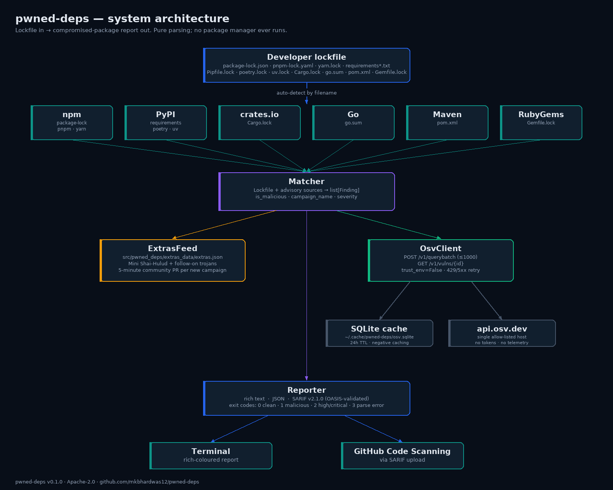

# pwned-deps v0.1.0

> **Drop your lockfile in, find out if you're pwned.** First public
> release of a multi-ecosystem CLI that scans developer lockfiles
> against [OSV.dev](https://osv.dev) plus an open community-maintained
> campaign feed for very-recent supply-chain incidents.

Paste this into the GitHub Release body when tagging `v0.1.0`. It's
plain GitHub-flavoured markdown; the diagrams referenced live under
`docs/images/` in this same tag.

---

## TL;DR

```bash
pipx install pwned-deps
pwned-deps check ./package-lock.json
```

Exit `1` if any compromised package is on disk, with the campaign
name, exposure window, published SHA-256 of the bad tarball, and
remediation list.

## What's in v0.1.0

### Lockfile coverage (11 shapes across 6 ecosystems)

| Ecosystem | Lockfiles                                                                            |
|-----------|--------------------------------------------------------------------------------------|
| npm       | `package-lock.json` (v1/v2/v3), `npm-shrinkwrap.json`, `pnpm-lock.yaml`, `yarn.lock` (v1 + Berry) |
| PyPI      | `requirements*.txt` / `requirements*.lock`, `Pipfile.lock`, `poetry.lock`, `uv.lock` |
| crates.io | `Cargo.lock`                                                                         |
| Go        | `go.sum`                                                                             |
| Maven     | `pom.xml` (`<dependencies>` + `<dependencyManagement>`)                              |
| RubyGems  | `Gemfile.lock`                                                                       |

### Output formats

- **`text`** (default) — rich-formatted terminal output with COMPROMISED /
  HIGH-CRITICAL groupings and 🚨 markers for malicious-package
  advisories.
- **`json`** — stable schema, top-level `{schema_version, tool, lockfiles[], summary}`.
  Lockfiles carry per-finding `id, package, version, severity,
  is_malicious, campaign_name, references`.
- **`sarif`** — SARIF v2.1.0 conforming to the OASIS schema, validated
  by [`jsonschema`](https://pypi.org/project/jsonschema/) at build
  time. Stable `partialFingerprints.primaryLocationLineHash` so
  GitHub Code Scanning dedups the same finding across runs.

### Bundled campaign feed (`extras.json`)

Two campaigns at launch, both sourced strictly from named research
blogs (no fabrication; see `TODO(precise-window)` markers inline
where a primary source did not publish exact UTC stamps):

- **EXTRA-2026-0001 — Mini Shai-Hulud (SAP CAP)** — `@cap-js/sqlite@2.2.2`,
  `@cap-js/postgres@2.2.2`, `@cap-js/db-service@2.10.1`, `mbt@1.2.48`.
  Window: 2026-04-29T09:55:00Z → 2026-04-29T14:00:00Z (start cited
  from [The Hacker News](https://thehackernews.com/2026/04/sap-npm-packages-compromised-by-mini.html);
  end is a conservative upper bound from [SecurityBridge's](https://securitybridge.com/blog/a-mini-shai-hulud-has-appeared-when-the-npm-supply-chain-reaches-into-sap/)
  "roughly two to four hours" phrasing). Published `.tgz` SHA-256
  digests included per [Wiz](https://www.wiz.io/blog/mini-shai-hulud-supply-chain-sap-npm).
- **EXTRA-2026-0002 — Follow-on (intercom-client + lightning)** —
  cross-ecosystem campaign by the same operator: npm
  `intercom-client@7.0.5` plus **PyPI** `lightning@2.6.2` and
  `lightning@2.6.3` (PyTorch Lightning, not an npm dep — flagged
  via per-package `ecosystem` overrides in `extras.json`). Shared C2
  `zero.masscan.cloud`, fallback channel via GitHub commits keyed
  `beautifulcastle`. Payload extended to target Kubernetes
  ServiceAccount tokens and HashiCorp Vault secrets ([Wiz](https://www.wiz.io/blog/mini-shai-hulud-supply-chain-sap-npm)).

### CLI flags

| Flag           | Purpose                                                                       |
|----------------|-------------------------------------------------------------------------------|
| `--format`     | `text` / `json` / `sarif`                                                     |
| `--offline`    | Cache only — no network                                                       |
| `--ci`         | Suppress decorations, deterministic exit code                                 |
| `--no-color`   | Disable color outside CI mode                                                 |
| `--cache-ttl`  | Cache TTL in hours (default `24`)                                             |
| `--cache-path` | Override SQLite cache location                                                |
| `--feed-file`  | Allow-listed extra campaign feed (JSON)                                       |
| `--explain`    | Print full advisory details for one ID (V1.1)                                 |

### Exit codes

| Code | Meaning                                  |
|------|------------------------------------------|
| `0`  | All clean                                |
| `1`  | At least one MAL-* / EXTRA-* hit         |
| `2`  | At least one HIGH/CRITICAL CVE hit       |
| `3`  | Parse error in any scanned lockfile      |

## Architecture




## Safety posture

- No execution of advisory or package content (no `eval` / `exec` /
  `subprocess` / `pickle.load` of user input — host-side regex scanner
  enforces this and a negative self-test plants `eval("1+1")` to prove
  the scanner catches it).
- Network allow-list: `api.osv.dev` only (and an opt-in
  `--feed-file PATH` you explicitly hand to it).
  `httpx.Client(trust_env=False)` so host proxy env vars cannot
  silently redirect traffic.
- Container-only dev with a non-root `appuser` UID 1000, base image
  pinned to a SHA-256 digest, source mounted read-only during tests,
  network denied (`--network none`) during `make test`.
- Hash-pinned dependencies; `pip install --require-hashes` aborts the
  build if any artifact's SHA-256 doesn't match.
- PyPI publish via [Trusted Publishers OIDC](https://docs.pypi.org/trusted-publishers/)
  — no long-lived API tokens.
- [SLSA Level 3 provenance](https://slsa.dev/spec/v1.0/levels#build-l3) for
  every release artifact via the official
  [`slsa-framework/slsa-github-generator`](https://github.com/slsa-framework/slsa-github-generator).
- Eat our own dog food: every CI run scans this project's own
  `pyproject.toml` + `requirements.lock`. If a malicious version of
  one of our own deps appeared, the release would be blocked.

## Verifying this release

The release artifacts ship with SLSA provenance attestations. To verify:

```bash
# Once slsa-verifier is on PATH (https://github.com/slsa-framework/slsa-verifier):
slsa-verifier verify-artifact \
  --provenance-path pwned_deps-0.1.0.intoto.jsonl \
  --source-uri github.com/mkbhardwas12/pwned-deps \
  pwned_deps-0.1.0-py3-none-any.whl
```

Both the `.whl` and `.tar.gz` carry SHA-256 hashes in the SLSA
attestation — pip's own integrity check then confirms the wheel
you actually install matches.

## Acknowledgements

The launch campaign data is sourced strictly from named public
research blogs:

- [The Hacker News — "SAP npm Packages Compromised by Mini Shai-Hulud"](https://thehackernews.com/2026/04/sap-npm-packages-compromised-by-mini.html)
- [SecurityBridge — "A Mini Shai-Hulud has Appeared"](https://securitybridge.com/blog/a-mini-shai-hulud-has-appeared-when-the-npm-supply-chain-reaches-into-sap/)
- [Wiz — "Mini Shai-Hulud supply-chain attack on SAP npm"](https://www.wiz.io/blog/mini-shai-hulud-supply-chain-sap-npm)

The vulnerability backbone is [OSV.dev](https://osv.dev), Google's
federation of GHSA, the PyPI Advisory Database, RustSec, the Go
vulnerability database, and the Ruby Advisory Database. SARIF schema
validation uses the bundled OASIS v2.1.0 schema sourced from
[json.schemastore.org](https://json.schemastore.org).

## What's next (not in v0.1.0)

- **V1.1** — drag-drop static web UI on GitHub Pages. Lockfile parsing
  in WASM via [Pyodide](https://pyodide.org), OSV calls direct from
  browser. Lockfile bytes never leave your machine.
- **V1.2** — Homebrew tap, npm-shim package so `npx pwned-deps@latest`
  works without a Python install.
- **V1.x** — auto-PR cron when the upstream extras feed is newer than
  the bundled file.

## License

Apache License 2.0 — see [LICENSE](https://github.com/mkbhardwas12/pwned-deps/blob/main/LICENSE).
